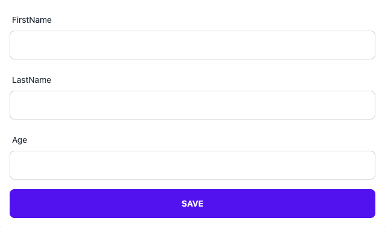

# Welcome to @thaddeusjiang/react-hook-form 👋

> Out of box form input components via react-hook-form and daisyUI


[](https://github.com/ThaddeusJiang/react-hook-form#readme)
[](https://github.com/ThaddeusJiang/react-hook-form/graphs/commit-activity)
[](https://github.com/ThaddeusJiang/react-hook-form/blob/main/LICENSE)
[](https://twitter.com/ThaddeusJiang)

### 🏠 [Homepage](https://github.com/ThaddeusJiang/react-hook-form#readme)

### [Demo](https://main--63ea2f10c3721b4155375582.chromatic.com)

## Features

- [x] Basic Inputs, e.g. `Input`, `InputNumber`, `Select`, `Checkbox`, `Radio`, `Switch`
- [x] Support `react-hook-form` v7 and `daisyUI` v2
- [x] Super easy to use

## Install

```sh
npm install @thaddeusjiang/react-hook-form
```

## Usage

```jsx
export const Profile = () => {
  const formMethods = useForm();

  const onSubmit = (data) => console.debug(data);

  return (
    <FormProvider {...formMethods}>
      <form onSubmit={formMethods.handleSubmit(onSubmit)}>
        <Field name="firstName">
          <Input id="firstName" name="firstName" />
        </Field>
        <Field name="lastName">
          <Input id="lastName" name="lastName" />
        </Field>
        <Field name="age">
          <InputNumber id="age" name="age" />
        </Field>

        <button type="submit">Save</button>
      </form>
    </FormProvider>
  );
};
```



More examples: [storybook](./stories/example.stories.tsx)

### Apply Styles

if you don't use [Tailwind CSS](https://tailwindcss.com/)

```ts
import { SortableList } from '@thaddeusjiang/react-hook-form';
import '@thaddeusjiang/react-hook-form/dist/index.css';
<SortableList ... />
```

if you use [Tailwind CSS](https://tailwindcss.com/)

```ts
import { SortableList } from '@thaddeusjiang/react-hook-form';
<SortableList ...>
```

modify tailwind.config.js

```diff
// tailwind.config.js
+ const path = require("path");
module.exports = {
  content: [
    "./src/**/*{js,ts,jsx,tsx}",
+    path.join(
+      require.resolve("@thaddeusjiang/react-hook-form"),
+      "../**/*.{js,ts,jsx,tsx}"
+    ),
  ],
  theme: {},
  plugins: [],
};
```

## Run tests

```sh
npm run test
```

## Author

👤 **Thaddeus Jiang**

- Website: https://thaddeusjiang.com/
- Twitter: [@ThaddeusJiang](https://twitter.com/ThaddeusJiang)
- Github: [@ThaddeusJiang](https://github.com/ThaddeusJiang)

## 🤝 Contributing

Contributions, issues and feature requests are welcome!

Feel free to check [issues page](https://github.com/ThaddeusJiang/react-hook-form/issues). You can also take a look at the [contributing guide](https://github.com/ThaddeusJiang/react-hook-form/blob/main/CONTRIBUTING.md).

## Show your support

Give a ⭐️ if this project helped you!

## 📝 License

Copyright © 2023 [Thaddeus Jiang](https://github.com/ThaddeusJiang).

This project is [MIT](https://github.com/ThaddeusJiang/react-hook-form/blob/main/LICENSE) licensed.

---

_This README was generated with ❤️ by [readme-md-generator](https://github.com/kefranabg/readme-md-generator)_
